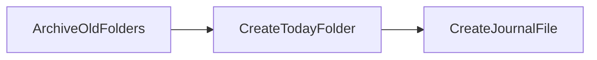

# Journal Automation Design

This project uses **PocketFlow** to automate creation of the daily journal folder.

## Flow Overview



1. **ArchiveOldFolders** – Move any existing date folders in `00_daily-journal` to the `archive/` hierarchy.
2. **CreateTodayFolder** – Create today's folder using the pattern `YYYY-MM-DD-<day>`.
3. **CreateJournalFile** – Place the journal template inside the new folder.

The automation can be triggered daily via cron. Run the script using the module
syntax so Python treats `journal_automation` as a package:

```
0 1 * * * python -m journal_automation.main
```

Running the script manually is also safe; it will not overwrite existing folders or files.
