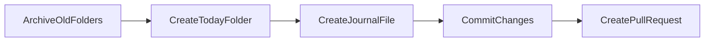

# Journal Automation Design

This project uses **PocketFlow** to automate creation of the daily journal folder.

## Flow Overview

1. **ArchiveOldFolders** – Move any existing date folders in `00_daily-journal` to the `archive/` hierarchy.
2. **CreateTodayFolder** – Create today's folder using the pattern `YYYY-MM-DD-<day>`.
3. **CreateJournalFile** – Place the journal template inside the new folder. If a PR was created yesterday, the file includes a task to review it with a link.
4. **CommitChanges** – Commit only the archived folders, leaving today's folder and journal file untracked.
5. **CreatePullRequest** – Open a pull request so the archive changes can be reviewed. The PR URL is saved for the next run.

The automation should be triggered daily via the macOS launchd facilty.

Running the script manually is also safe; it will not overwrite existing folders or files.

## Prerequisites

- Install the GitHub CLI (`gh`).
- Authenticate with GitHub using `gh auth login` so the automation can commit and open pull requests.
