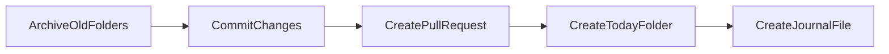

# Journal Automation Design

This project uses **PocketFlow** to automate creation of the daily journal folder.

## Flow Overview

1. **ArchiveOldFolders** – Move any existing date folders in `00_daily-journal` to the `archive/` hierarchy.
2. **CommitChanges** – Commit archived folders to the Git repository if changes exist.
3. **CreatePullRequest** – Open a pull request for those commits.
4. **CreateTodayFolder** – Create today's folder using the pattern `YYYY-MM-DD-<day>`.
5. **CreateJournalFile** – Place the journal template inside the new folder. If a pull request was opened, include a task linking to it.

The automation should be triggered daily via the macOS launchd facilty.

Running the script manually is also safe; it will not overwrite existing folders or files.

## Prerequisites

- Install the GitHub CLI (`gh`).
- Authenticate with GitHub using `gh auth login` so the automation can commit and open pull requests.
