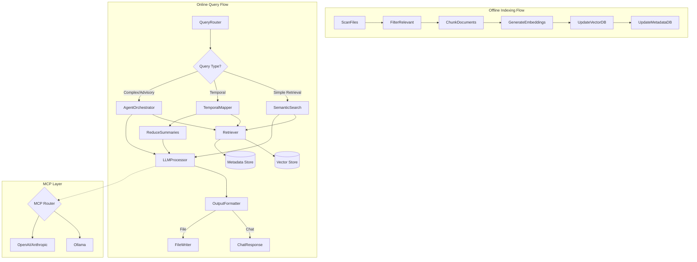

# Semantic Search System Design Document

## 1. Requirements

### Overview

Build a semantic search system for the business-os folder structure that can answer complex questions about business operations, projects, and daily activities. The system will integrate with existing PocketFlow automations and support both local and cloud LLM providers.

### Core Requirements

- **Source**: Markdown files, text files, and code in the business-os git repository
- **Update Frequency**: Daily batch indexing (scheduled or manual trigger)
- **Scale**: Single-user desktop system, optimized for search speed over memory usage
- **LLM Support**: Local-first with Ollama, cloud fallback for complex queries
- **Output**: Both chat interface responses and file writing to specified locations
- **Integration**: Expose functionality as PocketFlow nodes for other automations

### Example Query Types

- Temporal: "What have I been working on recently?" / "Summary of last 7 days"
- Entity-specific: "What are the attributes of my target customer for Markers Helper?"
- Predictive: "When will I run out of money?"
- Advisory: "What should I do today? Answer as if you were Steve Jobs"

## 2. Flow Design

### High-Level Architecture



### Design Patterns

- **Offline RAG**: For daily/manual indexing of business-os files
- **Agent Pattern**: For complex queries requiring multiple retrieval steps and reasoning
- **Map-Reduce**: For temporal summaries across multiple documents
- **MCP Integration**: Flexible LLM backend switching between local and cloud

## 3. Utilities

### File System Utilities (`utils/fs_utils.py`)

- **name**: `scan_directory`
- **input**: `root_path: str, extensions: List[str]`
- **output**: `List[Dict]` containing file paths and basic metadata
- **necessity**: Discovers all relevant files in business-os for indexing

### File System Utilities (`utils/fs_utils.py`)

- **name**: `get_file_metadata`
- **input**: `file_path: str`
- **output**: `Dict` with git history, modification time, size
- **necessity**: Provides temporal context for queries about recent work

### File System Utilities (`utils/fs_utils.py`)

- **name**: `read_file_content`
- **input**: `file_path: str`
- **output**: `str` (file content)
- **necessity**: Handles various file types (md, txt, yaml, code files)

### Embedding Utilities (`utils/embedding_utils.py`)

- **name**: `chunk_text`
- **input**: `text: str, file_type: str`
- **output**: `List[Dict]` with chunks and metadata
- **necessity**: Smart chunking that respects markdown headers and code structure

### Embedding Utilities (`utils/embedding_utils.py`)

- **name**: `generate_embeddings`
- **input**: `texts: List[str]`
- **output**: `np.array` of embeddings
- **necessity**: Creates vector representations using Ollama/nomic-embed-text

### Vector Store Utilities (`utils/vector_store.py`)

- **name**: `init_faiss`
- **input**: `dimension: int, index_type: str`
- **output**: `faiss.Index` object
- **necessity**: Initializes FAISS index optimized for search speed

### Vector Store Utilities (`utils/vector_store.py`)

- **name**: `search_similar`
- **input**: `query_embedding: np.array, k: int, filters: Dict`
- **output**: `List[Dict]` with similar documents and scores
- **necessity**: Core semantic search functionality with metadata filtering

### LLM Utilities (`utils/llm_utils.py`)

- **name**: `call_llm`
- **input**: `prompt: str, model: str, provider: str`
- **output**: `str` (LLM response)
- **necessity**: Abstract interface supporting both Ollama and cloud providers

### LLM Utilities (`utils/llm_utils.py`)

- **name**: `route_to_provider`
- **input**: `query_complexity: str, user_preference: str`
- **output**: `Dict` with provider and model selection
- **necessity**: MCP-style routing logic for local/cloud decision

### Query Processing (`utils/query_utils.py`)

- **name**: `classify_query`
- **input**: `query: str`
- **output**: `str` (query type: simple/temporal/complex/advisory)
- **necessity**: Routes queries to appropriate processing flow

### Query Processing (`utils/query_utils.py`)

- **name**: `extract_temporal_markers`
- **input**: `query: str`
- **output**: `Dict` with date ranges
- **necessity**: Parses "yesterday", "last week", etc. for temporal queries

## 4. Node Design

### Indexing Flow Nodes

**ScanFiles**

- **type**: Batch
- **prep**: Read configuration for paths to scan from shared store
- **exec**: Scan file system recursively, collect file paths with basic metadata
- **post**: Write file list to shared["files_to_index"]

**FilterRelevant**

- **type**: Regular
- **prep**: Read file list from shared["files_to_index"]
- **exec**: Apply filters (extensions, size limits, .gitignore rules)
- **post**: Write filtered list to shared["filtered_files"]

**ChunkDocuments**

- **type**: Batch
- **prep**: Read filtered file paths from shared["filtered_files"]
- **exec**: Read files and chunk intelligently based on file type
- **post**: Write chunks with metadata to shared["chunks"]

**GenerateEmbeddings**

- **type**: Batch
- **prep**: Read chunks from shared["chunks"]
- **exec**: Generate embeddings using Ollama/nomic-embed-text
- **post**: Write embeddings to shared["embeddings"]

**UpdateVectorDB**

- **type**: Regular
- **prep**: Read embeddings from shared["embeddings"]
- **exec**: Add vectors to FAISS index with IDs
- **post**: Save index to disk, update shared["index_updated"]

**UpdateMetadataDB**

- **type**: Regular
- **prep**: Read chunks and file metadata from shared
- **exec**: Store in SQLite (file paths, timestamps, chunk boundaries)
- **post**: Update shared["metadata_updated"]

### Query Flow Nodes

**QueryRouter**

- **type**: Regular
- **prep**: Read user query from shared["query"]
- **exec**: Classify query type using heuristics or simple LLM call
- **post**: Set shared["query_type"] and route to next node

**SemanticSearch**

- **type**: Regular
- **prep**: Read query and generate embedding
- **exec**: Search FAISS index for k most similar chunks
- **post**: Write retrieved chunks to shared["search_results"]

**TemporalMapper**

- **type**: Batch
- **prep**: Extract temporal markers from query
- **exec**: Query metadata DB for files in date range
- **post**: Write temporal file list to shared["temporal_files"]

**AgentOrchestrator**

- **type**: Agent
- **prep**: Read query and initial context
- **exec**: Plan multi-step retrieval strategy, execute searches
- **post**: Write comprehensive results to shared["agent_results"]

**LLMProcessor**

- **type**: Regular
- **prep**: Read search results and format into prompt
- **exec**: Call LLM via MCP router (local or cloud)
- **post**: Write response to shared["llm_response"]

**OutputFormatter**

- **type**: Regular
- **prep**: Read LLM response and output preferences
- **exec**: Format response for chosen output method
- **post**: Route to chat response or file writer

## 5. Implementation Notes

### Technology Stack

- **Vector Database**: FAISS (optimized for search speed)
- **Metadata Storage**: SQLite
- **Embeddings**: Ollama with nomic-embed-text model
- **Local LLM**: Ollama (various models)
- **Cloud LLM**: OpenAI/Anthropic APIs as fallback
- **Framework**: PocketFlow for node orchestration

### Shared Store Design

```python
shared = {
    "config": {
        "root_path": "/path/to/business-os",
        "file_extensions": [".md", ".txt", ".yaml", ".py", ".js"],
        "embedding_model": "nomic-embed-text",
        "llm_provider": "ollama",  # or "openai", "anthropic"
        "output_format": "chat"     # or "file"
    },
    "indexing": {
        "files_to_index": [],
        "filtered_files": [],
        "chunks": [],
        "embeddings": [],
        "index_updated": False,
        "metadata_updated": False
    },
    "query": {
        "query": "",
        "query_type": "",
        "search_results": [],
        "temporal_files": [],
        "agent_results": [],
        "llm_response": "",
        "output_path": ""  # for file output
    }
}
```

### Performance Optimizations

- Keep FAISS index in memory during queries (24GB RAM available)
- Batch embedding generation during indexing
- Cache frequently accessed metadata in memory
- Use IVF index type in FAISS for faster search on larger datasets

### Integration Points

- Expose `create_semantic_search_flow()` for PocketFlow integration
- Provide CLI interface for standalone usage
- Create simple API endpoint for external tool access
- Allow other automations to write summaries to daily journal folders

### Future Enhancements

- Annotation system for marking important LLM exchanges
- Incremental indexing for changed files only
- Query result caching
- Multi-modal support (images, diagrams)
- Automatic archival policies for old/unused content
